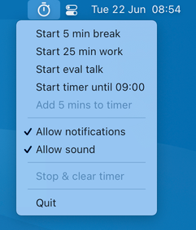

# MenubarTimer

> Small timer app that lives in menubar



- Counts down from 5, 25, or 45 minutes
- Counts down until the next whole hour
- Add extra 5 minutes to timer when running
- Optionally displays OS notification with/without sound after countdown is done
- When running, shows only the countdown (like `13:03`) and no icon
- Works with dark/light color scheme

## Setup

This is a Python3 app built with [Rumps](https://rumps.readthedocs.io/en/latest/index.html).

```bash
$ python3 -m venv env
$ source env/bin/activate
$ pip3 install -r requirements.txt
$ python3 menubar-timer.py
```

## Build MacOS app

```bash
$ python3 setup.py py2app
```

## Todo

- [ ] Make actual `.icns` file so that menubar icon will look good in notification
- [ ] Turn sound back on after Eval Talk timer is finished/gets stopped

Notes:

- Can’t be built w/ Github Actions because the `pyobjc` framework needed for Rumps is MacOS only and Github Actions builds on Linux. Building from source could work -> https://github.com/ronaldoussoren/pyobjc Good luck!

## License

[MIT](license)
